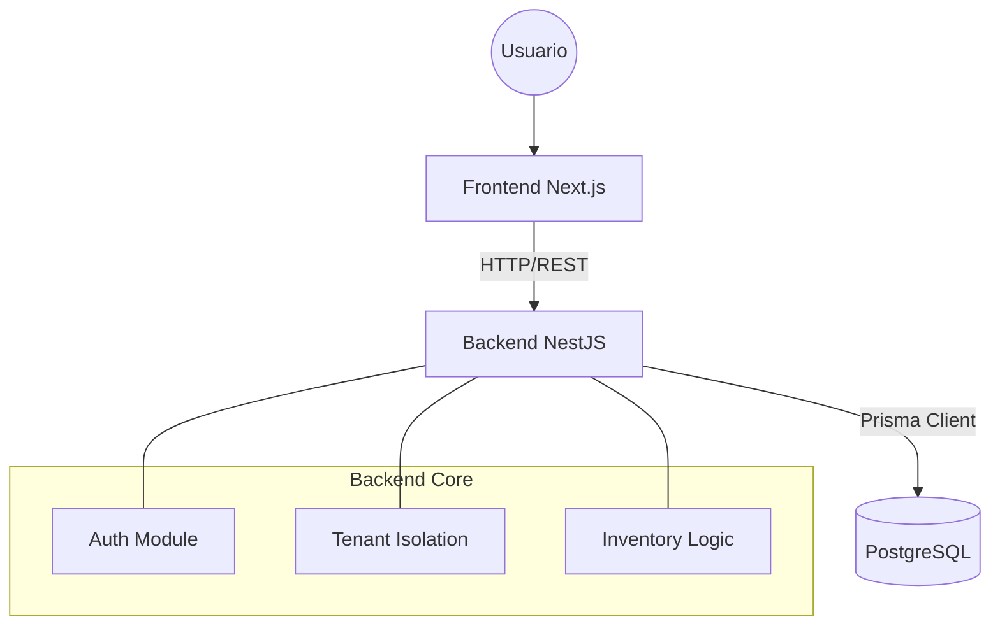

# Análisis Integral del Sistema: Inventory SaaS

> **Fecha:** 2026-01-27
> **Versión:** 1.0
> **Estado:** Análisis Inicial

Este documento presenta un análisis técnico y funcional detallado del sistema de Inventario SaaS Multi-tenant.

---

## 1. Resumen Ejecutivo

El sistema es una plataforma **SaaS (Software as a Service)** robusta diseñada para la gestión de inventarios y finanzas en sectores como Hotelería, Restaurantes y Retail. Su arquitectura **Multi-tenant** está correctamente implementada, garantizando el aislamiento de datos entre clientes.

**Estado Actual:**
- **Backend:** 🟢 **Avanzado**. Estructura modular sólida, lógica de negocio implementada, seguridad por tenant activa. Faltan pruebas unitarias automatizadas.
- **Base de Datos:** 🟢 **Completa**. Esquema Prisma bien definido con soporte para lotes, auditorías y conversiones.
- **Frontend:** 🟡 **En Progreso**. Interfaz de usuario moderna y responsiva, pero actualmente desconectada del backend (utiliza datos mockeados).

---

## 2. Arquitectura del Sistema

### 2.1 Stack Tecnológico

| Capa | Tecnología | Detalles |
|------|------------|----------|
| **Backend** | NestJS | Framework modular, TypeScript, Inyección de Dependencias. |
| **Frontend** | Next.js 16 | App Router, React 19, Tailwind CSS v4. |
| **Base de Datos** | PostgreSQL 16 | Relacional, robusta. Gestionada vía Docker. |
| **ORM** | Prisma | Type-safe query builder y schema management. |
| **UI Library** | Shadcn/UI | Componentes accesibles basados en Radix UI. |

### 2.2 Diagrama de Arquitectura

---

## 3. Análisis Detallado por Componente

### 3.1 Base de Datos (Prisma Schema)

El esquema (`prisma/schema.prisma`) es el punto más fuerte del sistema actual. Refleja fielmente los requerimientos de negocio complejos:

*   **Aislamiento:** Uso consistente de `tenantId` en todas las tablas clave (`Product`, `Warehouse`, `Movement`, etc.).
*   **Precisión Financiera:** Uso de `Decimal(15, 4)` para precios, costos y cantidades, evitando errores de redondeo típicos de `Float`.
*   **Trazabilidad:**
    *   Modelo `Batch` (Lotes) para control real de costos y vencimientos.
    *   Modelo `InventoryMovement` inmutable (Append-Only) para auditoría perfecta.
*   **Flexibilidad:** Uso de `JsonB` para configuraciones (`settings`) y metadatos extensibles.

### 3.2 Backend (NestJS)

La estructura en `backend/src/modules` está bien organizada por dominios:

*   **Modularidad:** Módulos claros (`products`, `inventory`, `tenants`, `auth`) que encapsulan su lógica.
*   **Seguridad:** Los servicios (ej. `ProductsService`) fuerzan el `tenantId` en todas las consultas, previniendo fugas de datos.
*   **Validación:** Se observan validaciones de negocio, como unicidad de SKU por tenant y pertenencia de categorías.

**Áreas de Mejora:**
*   **Testing:** La carpeta `backend/src` carece de archivos `*.spec.ts` o `*.test.ts`. Esto es un riesgo técnico alto.
*   **Documentación API:** No se observó configuración explícita de Swagger/OpenAPI (aunque podría estar en `main.ts`).

### 3.3 Frontend (Next.js)

La aplicación frontend tiene una base moderna y visualmente atractiva:

*   **Tecnología de Punta:** Uso de Next.js 16 y Tailwind v4.
*   **Componentes:** Uso de `shadcn/ui` y `lucide-react` para una interfaz limpia.
*   **Estructura:** Uso de App Router con grupos de rutas (`(dashboard)`), facilitando layouts anidados.

**Áreas de Mejora:**
*   **Integración:** Páginas como `inventory/page.tsx` usan funciones `getData()` con datos falsos (`mock-data`). No hay llamadas reales a la API (`fetch` o `axios`).
*   **Gestión de Estado:** No se observa una estrategia clara de gestión de estado global (Zustand, Redux, Context) o de data fetching (TanStack Query, SWR) para conectar con el backend.

---

## 4. Discrepancias Detectadas

1.  **Frontend Desconectado:** La interfaz promete funcionalidades (filtros, creación de productos) que solo funcionan visualmente. No persisten datos.
2.  **Ausencia de Tests:** A pesar de la lógica compleja en el backend (movimientos de inventario, cálculos de costos), no hay red de seguridad de pruebas unitarias.

---

## 5. Recomendaciones y Próximos Pasos

Para llevar el sistema a producción, se recomienda el siguiente plan de acción:

### Fase 1: Calidad y Estabilidad (Prioridad Alta)
1.  **Implementar Tests Unitarios:** Crear pruebas para los servicios críticos (`InventoryService`, `ProductsService`) asegurando que la lógica multi-tenant y los cálculos financieros sean correctos.
2.  **Configurar CI/CD Básico:** Asegurar que los tests corran en cada commit.

### Fase 2: Integración (Prioridad Alta)
1.  **Cliente API en Frontend:** Crear una capa de servicios en el frontend para comunicar con el backend.
2.  **Autenticación Real:** Implementar el flujo de login en el frontend y manejo de tokens JWT para las peticiones.
3.  **Reemplazar Mocks:** Conectar las tablas y formularios del dashboard a los endpoints reales.

### Fase 3: Funcionalidad Avanzada
1.  **Implementar WebSockets:** Para actualizaciones de stock en tiempo real (útil en POS).
2.  **Reportes:** Conectar el módulo de reportes con endpoints de agregación en el backend.

---

**Conclusión:** El sistema tiene cimientos excelentes. El backend y la base de datos están listos para soportar una operación compleja. El esfuerzo restante se concentra en conectar el frontend y asegurar la calidad mediante pruebas.
